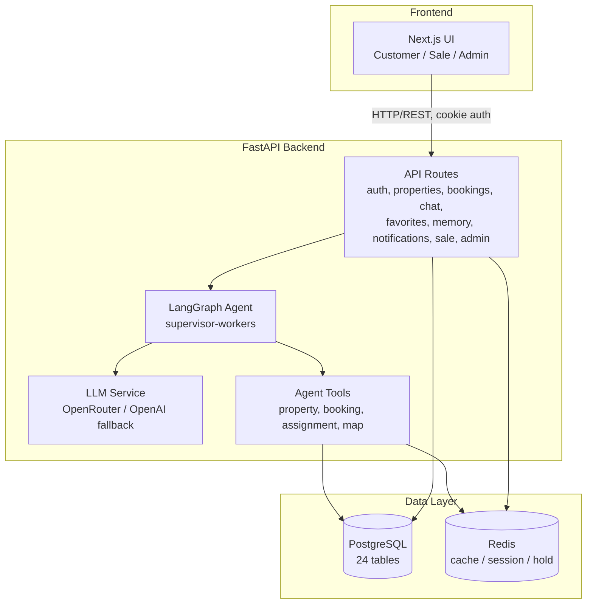
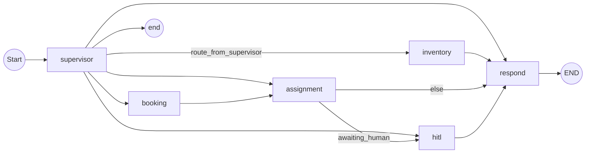
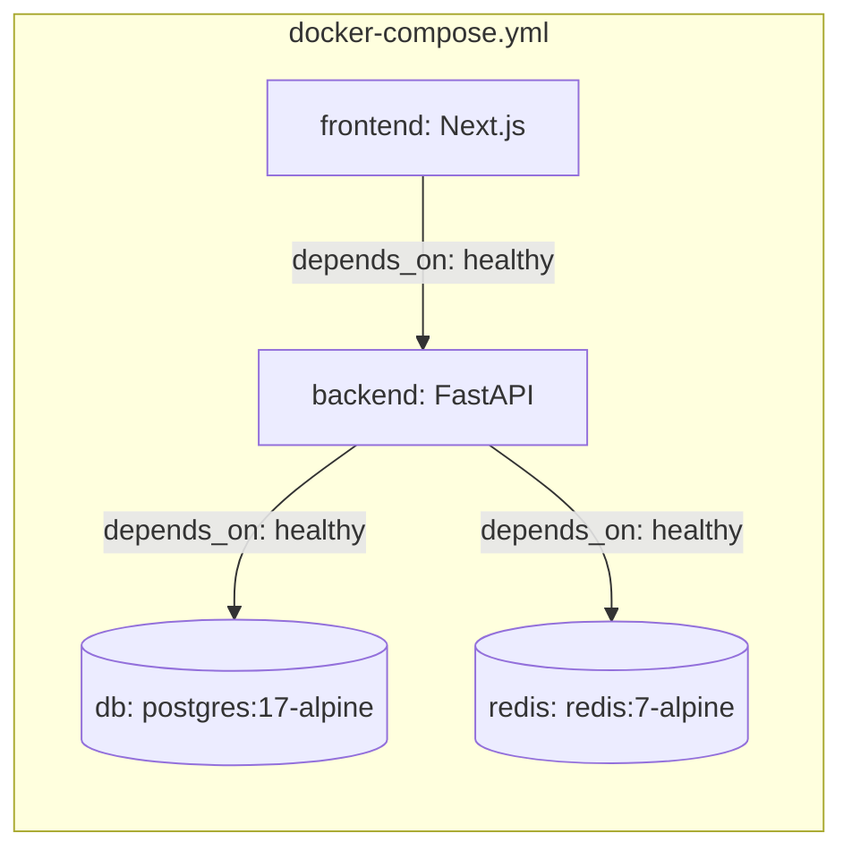

# Architecture Document

## System Overview

HomeMate AI (repo name: Booking Bot AI) là hệ thống tìm bất động sản và đặt lịch xem nhà, gồm frontend Next.js, backend FastAPI, một multi-agent LangGraph điều phối theo mô hình supervisor–workers, PostgreSQL làm nguồn dữ liệu chuẩn và Redis cho cache/session/property hold. Toàn bộ 4 service (db, redis, backend, frontend) chạy được qua Docker Compose, đã kiểm chứng chạy thật ngày 15/08/2026.

## Architecture Diagram

## Components

### 1. Frontend (Next.js)
- **Purpose:** Giao diện cho 3 vai trò — Khách hàng (tìm nhà, chat, đặt lịch xem, xem booking của mình), Sale (`/sale` — nhận/từ chối yêu cầu), Admin (`/admin` — quản lý booking & tài khoản).
- **Key Features:** Trang chủ + danh sách property có ảnh, chatbot, luồng đặt lịch, dashboard sale/admin.
- **Auth:** Session qua cookie HttpOnly, backend kiểm tra vai trò + quyền sở hữu ở mọi API nhạy cảm.

### 2. Backend (FastAPI)
- **Purpose:** REST API + orchestration cho agent.
- **API Design:** RESTful, chia theo domain — `src/api/routes/{auth,properties,bookings,chat,favorites,memory,notifications,sale,admin}.py`.
- **Authentication:** JWT (cookie), field cấu hình `JWT_SECRET_KEY`, `ACCESS_TOKEN_EXPIRE_MINUTES`, `AUTH_COOKIE_NAME`.

### 3. AI Agent (LangGraph) — supervisor-workers, không phải ReAct đơn lẻ
- **State schema** (`src/agents/state.py`, `AgentState`, TypedDict ~30 field): hội thoại (`query`, `messages`, `session_id`), context khách hàng (`customer_id`, `preferences`, `preferred_time_slots`), booking context (`selected_properties`, `selected_slots`, `booking_id`), search criteria, routing (`current_agent`, `intent`, `missing_fields`), HITL (`awaiting_human`, `hitl_case_id`, `human_decision`), tool calls/results, response, error handling.
- **Nodes** (`src/agents/graph.py::build_agent_graph`): `supervisor` (entry point, điều phối) → `inventory` (tìm property) / `booking` (tạo yêu cầu đặt lịch) / `assignment` (gán sale) / `hitl` (chờ người duyệt) / `respond` (sinh câu trả lời cuối).
- **Routing thật** (đọc trực tiếp từ code, không suy đoán):
  - `supervisor` → định tuyến có điều kiện tới 1 trong 5 nhánh: `inventory | booking | assignment | hitl | respond | end`.
  - `inventory` → `respond` → `END`.
  - `booking` → `assignment` (booking luôn cần gán sale tiếp theo).
  - `assignment` → có điều kiện: nếu `awaiting_human` thì sang `hitl`, ngược lại sang `respond`.
  - `hitl` → luôn sang `respond`.
  - Có sẵn `build_simple_graph()` — bản rút gọn chỉ 2 node (`supervisor` → `respond`) dùng để test nhanh không cần chạy đủ 6 node.
- **Tools** (`src/agents/tools/`):
  - `property_tools.py`: `search_properties`, `check_property_availability`, `hold_property`, `release_hold`.
  - `booking_tools.py`: `calculate_viewing_time`, `create_booking`, `propose_time_slots`, `get_booking_status`, `cancel_booking`.
  - `assignment_tools.py`: `calculate_assignment_score`, `assign_sale_to_booking`, `get_available_sales`, `check_sale_availability`.
  - `map_tools.py`: `get_property_location`, `get_property_map_embed`, `get_map_link_for_address`.
- **Flow (đúng theo `build_agent_graph()`):**

### 4. LLM Service (`src/services/llm.py`)
- Ưu tiên OpenRouter (đa model, có danh sách `MODEL_PRIORITY` để fallback khi 1 model lỗi/hết quota); nếu không có `OPENROUTER_API_KEY` thì fallback trực tiếp OpenAI với `["gpt-4o-mini", "gpt-4o"]`.
- **Trạng thái tại thời điểm viết tài liệu này: `.env` chưa có key thật (`OPENAI_API_KEY`/`OPENROUTER_API_KEY` vẫn là placeholder) — agent chưa được test với LLM thật, đây là việc cần làm ngay cho Gate 2.**

### 5. Database (PostgreSQL, không dùng Alembic — quản lý bằng SQL script tuần tự)
- **Tables:** 24 bảng, nạp qua 7 file `database/001_schema.sql` → `007_customer_memory.sql` (users, properties, tour_requests, tour_slot_options, property_holds, appointments, saved_properties, customer_memory...).
- **Seed/data thật:** `002_seed.sql`, `004_crawled_data.sql`, `005_batdongsan_data.sql` — dữ liệu crawl thật từ batdongsan.com.vn và chotot.com (`database/crawler_batdongsan.py`, `database/crawler_chotot.py`).

### 6. Redis
- Cache truy vấn property, session memory (có fallback in-memory nếu Redis không chạy), quản lý property hold tạm thời (15 phút), rate limiting, pub/sub.
- Scheduler (APScheduler) chạy job nền mỗi phút: hết hạn slot chờ, dọn hold hết hạn, tự động reassign yêu cầu booking chưa được sale phản hồi.

## Data Flow (luồng chính: khách tìm nhà → đặt lịch xem)

1. Khách gửi tin nhắn qua `/api/v1/chat` (frontend) hoặc thao tác trực tiếp trên UI danh sách property.
2. API route nhận, validate input, tạo/khôi phục `AgentState` theo `session_id`.
3. `supervisor` node phân tích intent (SEARCH_PROPERTY / BOOK_APPOINTMENT / ...), quyết định node tiếp theo.
4. Nếu tìm nhà: `inventory` gọi tool `search_properties` (đọc PostgreSQL) → trả kết quả → `respond` sinh câu trả lời qua LLM.
5. Nếu đặt lịch: `booking` gọi `create_booking`/`propose_time_slots` → `assignment` gọi `assign_sale_to_booking`/`calculate_assignment_score` để gán sale phù hợp → nếu cần duyệt thủ công thì vào `hitl` chờ sale xác nhận, ngược lại `respond` trả kết quả.
6. `hold_property` giữ căn tạm 15 phút trong Redis trong lúc chờ xử lý, tự hết hạn qua scheduler nếu không được xác nhận.
7. Response trả về Frontend, hiển thị theo đúng vai trò (khách/sale/admin).

## Deployment Architecture

Đã test thật (15/08/2026): `db` healthy, `redis` up, backend `/health` trả `200 {"status":"ok"}`, `/docs` load được, frontend build & serve thành công (`Ready in 7.3s`, HTML trả về đầy đủ).

## Security

- API keys/secrets nằm trong `.env` (gitignored), không commit.
- Input validation qua Pydantic schemas (`src/schemas/`).
- Auth: JWT cookie HttpOnly, kiểm tra role (`UserRole.SALE`, `UserRole.ADMIN`, `UserRole.COORDINATOR`) ở tầng route.
- Password hash bcrypt; tài khoản demo password chỉ được chấp nhận khi `APP_ENV=development`.

## Design Decisions

| Decision | Choice | Reason |
|----------|--------|--------|
| Framework | FastAPI | Async, tự sinh docs, type-safe qua Pydantic |
| Agent | LangGraph, supervisor-workers | Nhiều nghiệp vụ khác nhau (search/booking/assignment/HITL) cần định tuyến có điều kiện, dễ mở rộng node |
| LLM Provider | OpenRouter (đa model, fallback) → OpenAI trực tiếp | Chống phụ thuộc 1 provider, tiết kiệm chi phí |
| Database | PostgreSQL, SQL script tuần tự (không Alembic) | Đơn giản, dễ review từng migration trong 6 tuần |
| Cache/Session | Redis + fallback in-memory | Không chặn dev nếu Redis chưa sẵn sàng |
| Frontend | Next.js | SSR, quen thuộc với team, tách rõ 3 vai trò theo route |

## Ghi chú quan trọng cho Gate 2

Kiến trúc trên là **kiến trúc BookingBot/Sale-Booking-HITL đã build xong và chạy được về mặt kỹ thuật**, xây dựng theo brief trước Mentor Duty 11/08/2026. Nó khác với định hướng chat-first V2 hiện tại của Product (xem `docs/management/DECISION_LOG.md` D-014 — quyết định đang chờ). Tài liệu này mô tả đúng những gì **đã tồn tại và chạy được**, không mô tả kiến trúc mục tiêu V2.
