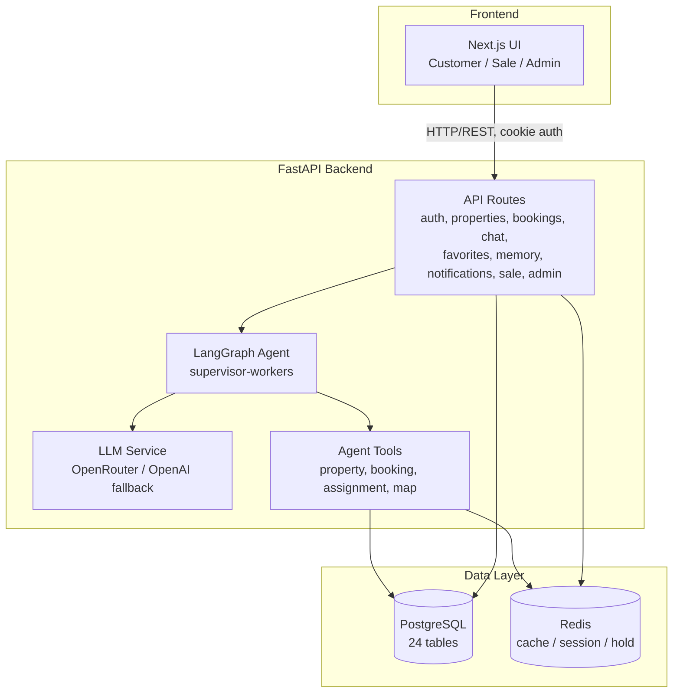
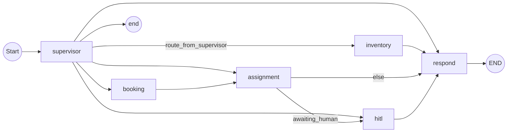
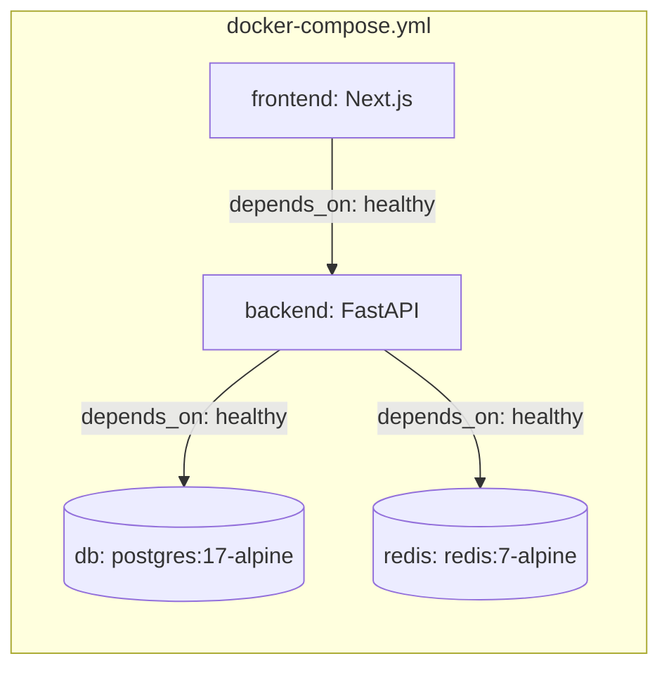

# Architecture Document

## System Overview

Repo này (đặt tên nội bộ là Booking Bot AI) làm một việc cụ thể: giúp người dùng tìm bất động sản và đặt lịch xem nhà qua hội thoại tự nhiên thay vì filter/form. Phần khó không nằm ở giao diện mà ở chỗ ai/cái gì được quyền quyết định — LLM chỉ được đề xuất, còn việc chốt lịch, giữ căn hay xác nhận booking luôn đi qua một lớp nghiệp vụ có transaction thật (PostgreSQL) để tránh hai người cùng giữ một căn cùng lúc. Bốn mảnh ghép chính là Next.js (giao diện), FastAPI (API + nghiệp vụ), một LangGraph multi-agent kiểu supervisor-workers (điều phối hội thoại), và PostgreSQL/Redis (dữ liệu + cache). Cả bốn đã dựng qua Docker Compose và chạy thật, kiểm tra lại ngày 15/08/2026 chứ không chỉ đọc code suy ra.

## Architecture Diagram

## Components

### 1. Frontend (Next.js)

Ba vai trò dùng chung một app nhưng thấy ba giao diện khác nhau: khách hàng tìm nhà/chat/đặt lịch ở trang chủ, sale nhận hoặc từ chối yêu cầu ở `/sale`, admin quản lý booking và tài khoản ở `/admin`. Đăng nhập dùng cookie HttpOnly, và mọi API nhạy cảm đều kiểm tra vai trò + quyền sở hữu ở phía backend chứ không tin frontend — vì frontend luôn có thể bị bypass.

### 2. Backend (FastAPI)

REST API chia theo domain, mỗi file route lo một mảng nghiệp vụ riêng (`src/api/routes/{auth,properties,bookings,chat,favorites,memory,notifications,sale,admin}.py`). Auth dùng JWT qua cookie, cấu hình qua `JWT_SECRET_KEY`, `ACCESS_TOKEN_EXPIRE_MINUTES`, `AUTH_COOKIE_NAME`. Một điểm dễ gây nhầm: có sẵn một endpoint WebSocket `/chat/ws` trông giống chat thật nhưng thực ra là mock cũ (comment ngay trong code ghi rõ), còn endpoint thật gọi agent là `POST /api/v1/chat` ở `src/api/routes/__init__.py` — nếu ai đó demo nhầm route WebSocket sẽ tưởng hệ thống đang trả lời "giả", cần lưu ý khi tích hợp frontend.

### 3. AI Agent (LangGraph)

Đây là phần dễ mô tả sai nhất nếu chỉ đọc lướt code, nên toàn bộ routing dưới đây lấy trực tiếp từ `build_agent_graph()`, không suy đoán từ tên hàm. Mô hình là supervisor-workers chứ không phải một vòng ReAct đơn lẻ: một node `supervisor` đóng vai trò điều phối, đọc hội thoại rồi quyết định giao việc cho node chuyên trách nào.

State (`AgentState` trong `src/agents/state.py`, một TypedDict khoảng 30 field) mang theo gần như mọi thứ một lượt hội thoại cần: nội dung chat (`query`, `messages`, `session_id`), thông tin khách (`customer_id`, `preferences`, `preferred_time_slots`), ngữ cảnh booking (`selected_properties`, `selected_slots`, `booking_id`), tiêu chí tìm kiếm, thông tin routing (`current_agent`, `intent`, `missing_fields`), trạng thái chờ người duyệt (`awaiting_human`, `hitl_case_id`, `human_decision`), cùng kết quả tool call và lỗi nếu có.

Sáu node trong graph: `supervisor` (điểm vào, điều phối) → `inventory` (tìm property) / `booking` (tạo yêu cầu đặt lịch) / `assignment` (gán sale) / `hitl` (chờ người duyệt) / `respond` (sinh câu trả lời cuối). Đường đi thực tế: từ `supervisor` rẽ có điều kiện sang một trong `inventory | booking | assignment | hitl | respond | end`; `inventory` luôn kết thúc ở `respond`; `booking` luôn phải qua `assignment` trước (vì đặt lịch nào cũng cần gán sale); `assignment` rẽ tiếp sang `hitl` nếu cần người duyệt, không thì thẳng tới `respond`; và `hitl` luôn kết ở `respond`. Ngoài ra còn có `build_simple_graph()` — bản rút gọn chỉ 2 node (`supervisor` → `respond`), dùng để test nhanh khi không cần chạy hết cả 6 node.

Bốn nhóm tool tương ứng bốn node nghiệp vụ: `property_tools.py` (`search_properties`, `check_property_availability`, `hold_property`, `release_hold`), `booking_tools.py` (`calculate_viewing_time`, `create_booking`, `propose_time_slots`, `get_booking_status`, `cancel_booking`), `assignment_tools.py` (`calculate_assignment_score`, `assign_sale_to_booking`, `get_available_sales`, `check_sale_availability`), và `map_tools.py` (`get_property_location`, `get_property_map_embed`, `get_map_link_for_address`).

### 4. LLM Service (`src/services/llm.py`)

Ưu tiên OpenRouter — có danh sách `MODEL_PRIORITY` để tự chuyển model khác khi một model lỗi hoặc hết quota, bắt đầu từ vài model free (Nemotron, Gemma, Llama, Mistral...). Nếu không set `OPENROUTER_API_KEY` thì rơi về gọi OpenAI trực tiếp với `["gpt-4o-mini", "gpt-4o"]`. Đã kiểm chứng thật ngày 15/08/2026: gọi qua OpenRouter, model `nvidia/nemotron-3-ultra-550b-a55b:free`, nhận `200 OK` — không còn ở trạng thái "chưa có key thật" như lúc mới viết tài liệu này. Chi tiết ở `eval/results/gate2_eval_evidence.md`.

### 5. Database

PostgreSQL, không dùng Alembic mà quản lý bằng 7 file SQL chạy tuần tự (`database/001_schema.sql` → `007_customer_memory.sql`) — 24 bảng, gồm users, properties, tour_requests, tour_slot_options, property_holds, appointments, saved_properties, customer_memory... Dữ liệu không phải seed giả toàn bộ: `004_crawled_data.sql` và `005_batdongsan_data.sql` là dữ liệu crawl thật từ batdongsan.com.vn và chotot.com (`database/crawler_batdongsan.py`, `crawler_chotot.py`).

### 6. Redis

Dùng cho cache truy vấn property, session memory (rơi về in-memory nếu Redis không chạy, không chặn dev), giữ property hold tạm 15 phút, và rate limiting/pub-sub. Có một scheduler (APScheduler) chạy nền mỗi phút để dọn slot/hold hết hạn và tự động reassign những yêu cầu booking mà sale chưa kịp phản hồi.

## Data Flow (luồng chính: khách tìm nhà → đặt lịch xem)

1. Khách gửi tin nhắn qua `/api/v1/chat` (frontend) hoặc thao tác trực tiếp trên UI danh sách property.
2. API route nhận, validate input, tạo/khôi phục `AgentState` theo `session_id`.
3. `supervisor` node phân tích intent (SEARCH_PROPERTY / BOOK_APPOINTMENT / ...), quyết định node tiếp theo.
4. Nếu tìm nhà: `inventory` gọi tool `search_properties` (đọc PostgreSQL) → trả kết quả → `respond` sinh câu trả lời qua LLM.
5. Nếu đặt lịch: `booking` gọi `create_booking`/`propose_time_slots` → `assignment` gọi `assign_sale_to_booking`/`calculate_assignment_score` để gán sale phù hợp → nếu cần duyệt thủ công thì vào `hitl` chờ sale xác nhận, ngược lại `respond` trả kết quả.
6. `hold_property` giữ căn tạm 15 phút trong Redis trong lúc chờ xử lý, tự hết hạn qua scheduler nếu không được xác nhận.
7. Response trả về Frontend, hiển thị theo đúng vai trò (khách/sale/admin).

## Deployment Architecture

Đã test thật (15/08/2026): `db` healthy, `redis` up, backend `/health` trả `200 {"status":"ok"}`, `/docs` load được, frontend build & serve thành công (`Ready in 7.3s`, HTML trả về đầy đủ).

## Security

- API keys/secrets nằm trong `.env` (gitignored), không commit.
- Input validation qua Pydantic schemas (`src/schemas/`).
- Auth: JWT cookie HttpOnly, kiểm tra role (`UserRole.SALE`, `UserRole.ADMIN`, `UserRole.COORDINATOR`) ở tầng route.
- Password hash bcrypt; tài khoản demo password chỉ được chấp nhận khi `APP_ENV=development`.

## Design Decisions

| Decision | Choice | Reason |
|----------|--------|--------|
| Framework | FastAPI | Async, tự sinh docs, type-safe qua Pydantic |
| Agent | LangGraph, supervisor-workers | Nhiều nghiệp vụ khác nhau (search/booking/assignment/HITL) cần định tuyến có điều kiện, dễ mở rộng node |
| LLM Provider | OpenRouter (đa model, fallback) → OpenAI trực tiếp | Chống phụ thuộc 1 provider, tiết kiệm chi phí |
| Database | PostgreSQL, SQL script tuần tự (không Alembic) | Đơn giản, dễ review từng migration trong 6 tuần |
| Cache/Session | Redis + fallback in-memory | Không chặn dev nếu Redis chưa sẵn sàng |
| Frontend | Next.js | SSR, quen thuộc với team, tách rõ 3 vai trò theo route |

## Ghi chú quan trọng cho Gate 2

Kiến trúc trên là **kiến trúc BookingBot/Sale-Booking-HITL đã build xong và chạy được về mặt kỹ thuật**, xây dựng theo brief trước Mentor Duty 11/08/2026. Nó khác với định hướng chat-first V2 hiện tại của Product (xem `docs/management/DECISION_LOG.md` D-014 — quyết định đang chờ). Tài liệu này mô tả đúng những gì **đã tồn tại và chạy được**, không mô tả kiến trúc mục tiêu V2.
