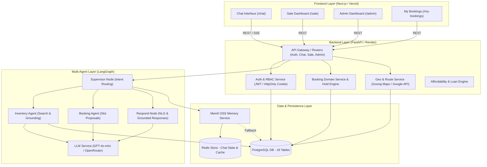

# Architecture Document — Nera AI Real Estate Platform

## System Overview

Nera là nền tảng AI Agent đàm thoại cho bất động sản O2O (Online-to-Offline), kết hợp giữa **Next.js (Frontend)**, **FastAPI (Backend)** và hệ thống **Multi-Agent trên LangGraph**. Hệ thống cho phép người dùng tìm kiếm BĐS bằng ngôn ngữ tự nhiên với bộ nhớ ngữ cảnh đa lượt (Mem0/Redis/PostgreSQL), tính toán khoảng cách/tuyến đường (Goong/Google Maps), tính toán khả năng tài chính (Affordability) và đặt lịch xem nhà có sự xác nhận của chuyên viên Sale qua cơ chế Human-in-the-loop (HITL).

## Architecture Diagram

## Components

### 1. Frontend (Next.js App Router)
- **Công nghệ:** Next.js 14, React, TypeScript, Tailwind CSS, Lucide Icons.
- **Tính năng chính:**
  - Giao diện trò chuyện trực quan với hiệu ứng Typewriter, Property Cards tương tác, bản đồ chỉ đường Goong Maps nhúng Iframe.
  - Phân hệ quản trị và vận hành chuyên biệt: Dashboard Sale (`/sale`) duyệt/từ chối lịch hẹn, Dashboard Admin (`/admin`) theo dõi KPIs và người dùng, Trang quản lý lịch cá nhân (`/my-bookings`).
- **Quản lý trạng thái:** React Hooks, Server/Client components, Session state qua HttpOnly Cookies.

### 2. Backend (FastAPI)
- **Công nghệ:** Python 3.11+, FastAPI, SQLAlchemy (Asyncpg), Pydantic v2.
- **Thiết kế API:** RESTful API chuẩn OpenAPI, hỗ trợ SSE (Server-Sent Events) cho streaming phản hồi AI.
- **Xác thực & Phân quyền (RBAC):**
  - Quản lý phiên bằng JWT lưu trong HttpOnly Cookie.
  - Hỗ trợ 4 vai trò: `CUSTOMER`, `SALE`, `COORDINATOR`, `ADMIN` qua dependency `require_roles`.
  - Tự động khóa Swagger Docs (`/docs`, `/redoc`) ở môi trường Production.

### 3. AI Multi-Agent (LangGraph)
- **Mô hình Agent:** Supervisor-Worker Multi-Agent Graph với Structured Outputs.
- **Các Nodes chính:**
  - `Supervisor`: Phân tích ý định người dùng (GREETING, SEARCH, BOOKING, AFFORDABILITY, OUT_OF_SCOPE), duy trì tiêu chí tìm kiếm qua nhiều lượt hội thoại.
  - `InventoryAgent`: Truy vấn PostgreSQL với các ràng buộc cứng (giá, quận/huyện, số phòng, diện tích, pháp lý), tích hợp tính toán địa lý Goong Maps.
  - `BookingAgent`: Kiểm tra slot khả dụng, đối soát lịch Sale, tạo đề xuất giờ hẹn.
  - `RespondNode`: Tạo câu trả lời tự nhiên có gắn nhãn nguồn gốc (`llm_grounded`, `llm_direct`, `llm_intent`, `fallback`).
- **Memory Layer:** Tích hợp `Mem0 OSS` lưu trữ sở thích dài hạn (khoảng giá, khu vực yêu thích) và lịch sử hội thoại ngắn hạn qua Redis (có In-memory fallback).

### 4. Database & Storage
- **Hệ quản trị CSDL:** PostgreSQL (18 bảng: `users`, `properties`, `property_media`, `appointments`, `property_holds`, `sale_profiles`, `customer_profiles`, `conversations`, `messages`, `customer_preferences`, `daily_route_plans`, ...).
- **Dữ liệu thực tế:** Hơn 1.000+ bản ghi BĐS crawl thực tế từ Batdongsan.com.vn và Chotot.com khu vực Hà Nội.
- **Bảo toàn giao dịch:** Row-level locking khi giữ căn (`PropertyHold`) trong 15 phút, chống xung đột lịch (Double-booking).

---

## Data Flow (Luồng dữ liệu)

1. **Khách hàng gửi tin nhắn** từ Frontend `/chat`.
2. **API Router** nhận request, xác thực danh tính qua Cookie JWT.
3. **Supervisor Agent** tải ngữ cảnh từ Mem0/Redis, phân tích Intent và cập nhật tiêu chí tìm kiếm (`search_criteria`).
4. **Worker Agent (Inventory / Booking)** truy vấn dữ liệu từ PostgreSQL hoặc tính khoảng cách qua Goong Maps API.
5. **Respond Node** tổng hợp câu trả lời, gắn nhãn minh bạch (`ai_mode`) và trả về Frontend.
6. **Đặt lịch & HITL:** Khi khách chốt lịch, hệ thống tạo bản ghi giữ chỗ 15 phút (`PropertyHold`); Sale đăng nhập `/sale` để bấm nhận/từ chối trước khi chính thức tạo `Appointment`.

---

## Deployment Architecture

- **Frontend:** Vercel (CI/CD từ GitHub repo `main`/`develop`).
- **Backend:** Render Web Service (FastAPI container).
- **Database:** PostgreSQL Cloud Managed Instance.
- **Domain Production:** `https://www.nerahome.space/`

---

## Security & Resilience (Bảo mật & Độ tin cậy)

- **Bảo vệ mật khẩu:** Hash bcrypt cho tài khoản thật; chốt chặn Demo Password Guard chỉ cho phép mật khẩu demo khi `APP_ENV=development`.
- **Google OAuth:** Sinh mật khẩu ngẫu nhiên mật mã (`secrets.token_urlsafe(32)`) cho tài khoản OAuth, ngăn chặn tấn công đoán mật khẩu `gauth_<email>`.
- **Chống rò rỉ dữ liệu (Error Shielding):** Giấu chi tiết lỗi SQL (`str(e)`), ghi log nội bộ qua `logger.exception()` và trả thông báo chung cho client.
- **Cơ chế Fallback kiên cường:** Khi Redis sập -> tự chuyển sang bộ nhớ RAM; khi LLM Provider lỗi -> tự chuyển sang Rule-based Fallback và gắn nhãn rõ ràng trên UI.

---

## Design Decisions

| Quyết định | Lựa chọn | Lý do kỹ thuật & nghiệp vụ |
|---|---|---|
| **Backend Framework** | FastAPI | Bất đồng bộ (Async I/O), hiệu năng cao, type-safety Pydantic, dễ tích hợp LangGraph |
| **Agent Orchestration**| LangGraph | Kiểm soát luồng linh hoạt (State Graph), dễ quản lý điều kiện rẽ nhánh và duy trì state đa lượt |
| **Database** | PostgreSQL | Quan hệ dữ liệu chặt chẽ giữa BĐS, Slot lịch và User; hỗ trợ giao dịch ACID chống double-booking |
| **Frontend** | Next.js 14 | App Router tối ưu SEO, hỗ trợ Server/Client components, render giao diện mượt mà |
| **Memory Architecture**| Mem0 + Redis | Truy xuất ngữ cảnh siêu tốc (<10ms), có cơ chế In-memory fallback khi mất kết nối Redis |
| **Human-in-the-loop** | Sale Approval | Đảm bảo tính pháp lý và trách nhiệm con người, ngăn ngừa AI tự ý tạo lịch ảo |
