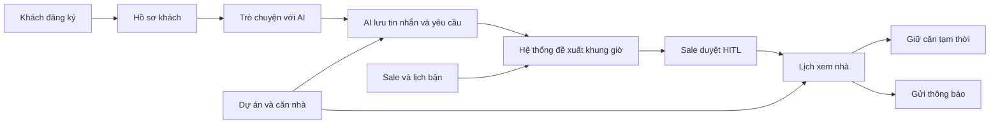

## 1. Luồng dữ liệu tổng thể



Luồng ngắn gọn:

```text
users/customer_profiles
→ conversations/messages
→ tour_requests
→ tour_slot_options
→ approval_requests
→ appointments
→ property_holds + notifications
```

## 2. Danh mục 16 bảng

| STT | Bảng | Bảng dùng để làm gì? | Dùng ở đâu trong website? | Khi nào đọc/ghi? | Quan hệ chính |
|---:|---|---|---|---|---|
| 1 | `users` | Lưu tài khoản chung: email, số điện thoại, mật khẩu đã mã hóa, họ tên, vai trò và trạng thái tài khoản. | Đăng ký, đăng nhập, quản lý người dùng, phân quyền khách/sale/điều phối viên. | Ghi khi đăng ký; đọc khi đăng nhập và kiểm tra quyền; cập nhật khi đổi hồ sơ hoặc khóa tài khoản. | Được tham chiếu bởi hồ sơ khách, hồ sơ sale, phê duyệt và thông báo. |
| 2 | `customer_profiles` | Lưu thông tin riêng của khách: mã khách, ngân sách, ngày dự kiến chuyển vào và kênh liên hệ mong muốn. | Trang hồ sơ khách và phần AI làm rõ nhu cầu. | Tạo sau khi đăng ký tài khoản khách; đọc khi AI tư vấn; cập nhật khi khách thay đổi nhu cầu. | Mỗi bản ghi tương ứng đúng một `users` có vai trò `CUSTOMER`. |
| 3 | `sale_profiles` | Lưu hồ sơ nhân viên sale: mã nhân viên, chi nhánh, chuyên môn, giờ làm, giới hạn số lịch mỗi ngày và kết nối lịch ngoài. | Trang quản lý sale, chọn sale phù hợp và kiểm tra khả năng nhận lịch. | Ghi khi tạo tài khoản sale; đọc khi đề xuất khung giờ và phân công lịch. | Mỗi bản ghi tương ứng một `users` có vai trò `SALE`. |
| 4 | `projects` | Lưu thông tin dự án bất động sản và chính sách giữ căn mặc định. | Trang danh sách/chi tiết dự án; cấu hình thời hạn soft-hold. | Nhân viên nhập hoặc cập nhật; khách và AI chủ yếu đọc. | Một dự án có nhiều `properties`. |
| 5 | `properties` | Lưu dữ liệu chính của căn nhà hoặc đất: loại, vị trí, diện tích, giá, pháp lý, số phòng, đặc điểm và trạng thái còn bán. | Tìm kiếm, lọc, gợi ý và trang chi tiết bất động sản. | Sale/điều phối viên ghi và cập nhật; AI và khách đọc để tìm căn phù hợp. | Thuộc một `projects`; liên kết ảnh, sale phụ trách, yêu cầu xem, lịch hẹn và giữ căn. |
| 6 | `property_media` | Lưu ảnh, video, mặt bằng và virtual tour của từng căn. | Thư viện ảnh trên trang chi tiết căn nhà. | Ghi khi nhân viên đăng nội dung; đọc khi hiển thị căn nhà. | Nhiều media thuộc một `properties`. |
| 7 | `property_sale_assignments` | Cho biết sale nào đang phụ trách căn nào và ai là sale chính. | Màn hình phân công sale; hệ thống chọn sale khi khách muốn xem căn. | Điều phối viên ghi/cập nhật; hệ thống đọc khi đề xuất sale. | Bảng nối giữa `properties` và `sale_profiles`. |
| 8 | `sale_unavailability` | Lưu những khoảng thời gian sale bận, nghỉ hoặc đã đồng bộ từ Google/Outlook Calendar. | Chức năng kiểm tra lịch trống của sale. | Ghi khi sale báo bận hoặc đồng bộ lịch; đọc trước khi đề xuất/chốt lịch. | Mỗi khoảng bận thuộc một `sale_profiles`. |
| 9 | `conversations` | Lưu một phiên hội thoại giữa khách và AI, kèm trạng thái và bản tóm tắt. | Màn hình chat AI và lịch sử hội thoại. | Tạo khi khách bắt đầu chat; cập nhật tóm tắt trong quá trình trò chuyện; đóng khi kết thúc. | Thuộc một `customer_profiles`; chứa nhiều `messages`. |
| 10 | `messages` | Lưu từng tin nhắn của khách, AI, hệ thống hoặc kết quả gọi tool. | Nội dung cửa sổ chat; khôi phục lịch sử để AI tiếp tục hội thoại. | Ghi sau mỗi lượt chat/tool call; đọc khi mở cuộc trò chuyện hoặc tạo context cho AI. | Nhiều tin nhắn thuộc một `conversations`. |
| 11 | `tour_requests` | Lưu yêu cầu xem một căn cụ thể: khách nào, căn nào, thời gian mong muốn, số người và yêu cầu đã được AI trích xuất. | Bước “Đặt lịch xem nhà” sau khi khách chọn căn. | Tạo khi khách bấm yêu cầu xem; cập nhật khi AI hỏi thêm hoặc khách đổi thời gian. | Liên kết khách, căn và cuộc trò chuyện; có nhiều `tour_slot_options`. |
| 12 | `tour_slot_options` | Lưu các khung giờ được hệ thống đề xuất, sale dự kiến, địa điểm gặp và điểm phù hợp. | Màn hình cho khách chọn một trong các giờ đề xuất. | Ghi sau khi kiểm tra lịch sale; đọc để hiển thị lựa chọn; cập nhật khi khách chọn hoặc khung giờ hết hạn. | Thuộc một `tour_requests` và một `sale_profiles`. |
| 13 | `approval_requests` | Lưu yêu cầu HITL để sale/điều phối viên duyệt khung giờ trước khi chốt lịch. | Hàng đợi “Chờ duyệt” của sale; thao tác chấp nhận hoặc từ chối. | Tạo khi khách chọn khung giờ; cập nhật khi sale duyệt/từ chối hoặc yêu cầu hết hạn. | Liên kết `tour_requests`, `tour_slot_options`, người duyệt và sale được duyệt. |
| 14 | `appointments` | Lưu lịch xem nhà đã được sale xác nhận: khách, căn, sale, thời gian, địa điểm và trạng thái lịch. | Lịch của khách, lịch làm việc của sale, check-in, hoàn thành, no-show hoặc hủy lịch. | Chỉ tạo sau khi `approval_requests` đã được duyệt; cập nhật trong vòng đời lịch hẹn. | Liên kết yêu cầu xem, phê duyệt, khách, căn và sale. |
| 15 | `property_holds` | Lưu việc giữ căn tạm thời: ai giữ, căn nào, bắt đầu khi nào, hết hạn khi nào và trạng thái giữ. | Hiển thị “đang được giữ”, đồng hồ đếm ngược và cảnh báo sắp hết hạn. | Tạo bằng hàm `create_property_hold`; cập nhật khi hết hạn, giải phóng hoặc chuyển đổi. | Gắn với một `appointments`, một `properties` và một khách. |
| 16 | `notifications` | Lưu hàng đợi thông báo qua web, email, SMS hoặc push; theo dõi gửi thành công/thất bại. | Xác nhận lịch, nhắc lịch, báo hủy/dời và cảnh báo soft-hold sắp hết hạn. | Ghi khi phát sinh sự kiện; worker đọc bản ghi `PENDING` để gửi rồi cập nhật trạng thái. | Thuộc một `users`; có thể gắn với một `appointments`. |

## 3. Hai view hỗ trợ API

View không phải bảng và không lưu thêm một bản dữ liệu riêng. View chỉ tổng hợp dữ liệu có sẵn để backend truy vấn thuận tiện hơn.

| View | Dùng để làm gì? | Ví dụ nơi sử dụng |
|---|---|---|
| `v_property_live_status` | Trả về trạng thái thực tế của căn. Nếu căn `AVAILABLE` nhưng có soft-hold còn hiệu lực thì hiển thị `SOFT_HELD`. | Danh sách căn, trang chi tiết căn và tool kiểm tra trạng thái căn của AI. |
| `v_sale_daily_schedule` | Tổng hợp các lịch đã xác nhận của từng sale theo ngày. | Trang lịch làm việc của sale và tool kiểm tra lịch trống. |

## 4. Chức năng từng bảng

| Chức năng | Bảng được đọc | Bảng được ghi/cập nhật |
|---|---|---|
| Đăng ký/đăng nhập | `users` | `users`, `customer_profiles` hoặc `sale_profiles` |
| Khách tìm và xem căn | `projects`, `properties`, `property_media`, `v_property_live_status` | Không bắt buộc ghi |
| AI tư vấn nhu cầu | `customer_profiles`, `properties`, `conversations`, `messages` | `conversations`, `messages` |
| Chọn sale phù hợp | `property_sale_assignments`, `sale_profiles`, `sale_unavailability` | Không bắt buộc ghi |
| Đề xuất khung giờ | `sale_unavailability`, `appointments`, `tour_requests` | `tour_slot_options` |
| Sale duyệt HITL | `approval_requests`, `tour_slot_options`, `tour_requests` | `approval_requests` |
| Chốt lịch xem nhà | `approval_requests`, `sale_unavailability`, `properties` | `appointments`, `notifications` |
| Giữ căn tạm thời | `appointments`, `properties`, `property_holds` | `property_holds` |
| Nhắc lịch | `appointments`, `users` | `notifications` |
| Hủy lịch | `appointments`, `property_holds` | `appointments`; trigger tự giải phóng hold |

## 5. Các quy tắc quan trọng đã có trong database

- Một email chỉ thuộc một tài khoản.
- Một căn chỉ có một sale chính đang hoạt động.
- Một yêu cầu chỉ được chọn một khung giờ.
- Một yêu cầu chỉ có một phê duyệt `PENDING` tại một thời điểm.
- Không thể tạo `appointments` nếu sale chưa duyệt HITL.
- Không thể đặt hai lịch trùng thời gian cho cùng một sale.
- Không thể đặt hai lịch trùng thời gian cho cùng một căn.
- Không thể đặt lịch vào khoảng sale đã báo bận.
- Một căn chỉ có một soft-hold đang hoạt động.
- Việc tạo hold dùng row-lock để chống hai người giữ cùng căn đồng thời.
- Khi lịch bị hủy hoặc dời, hold đang hoạt động được tự giải phóng.


