# Architecture Document — Nera AI Real Estate Platform (P-046)

## 1. System Overview

**Nera** là nền tảng AI Agent đàm thoại cho bất động sản O2O (Online-to-Offline), kết hợp giữa **Next.js 14 (Frontend)**, **FastAPI (Backend)** và hệ thống **Multi-Agent trên LangGraph**. 

Hệ thống giải quyết triệt để bài toán đứt gãy giao dịch bất động sản bằng cách:
- Cho phép tìm kiếm BĐS bằng ngôn ngữ tự nhiên với bộ nhớ ngữ cảnh đa lượt (`CustomerMemoryService` / Redis / PostgreSQL).
- Tính toán khoảng cách và thời gian di chuyển đi làm thực tế qua **Goong Maps / Google Routes API**.
- Tư vấn khả năng tài chính và trả góp ngân hàng (Amortization Loan Engine).
- Đặt lịch xem nhà thực địa có sự xác nhận của chuyên viên Sale qua cơ chế **Human-in-the-loop (HITL)** kết hợp khóa giữ chỗ 15 phút (`PropertyHold`).

---

## 2. Architecture Diagram

```mermaid
graph TB
    subgraph Client["Frontend Layer (Next.js 14 / Vercel)"]
        UI_Chat["Chat Interface (/chat)"]
        UI_Sale["Sale Dashboard (/sale)"]
        UI_Admin["Admin Dashboard (/admin)"]
        UI_Bookings["My Bookings (/my-bookings)"]
        UI_Props["Property Explorer (/properties)"]
    end

    subgraph Backend["Backend Layer (FastAPI / Render)"]
        Router["API Gateway / Routers (Auth, Chat, Sale, Admin, Bookings)"]
        AuthService["Auth & RBAC Service (JWT HttpOnly Cookie)"]
        BookingService["Booking Domain Service & Hold Engine"]
        GeoService["Geo & Route Service (Goong Maps / Google Routes)"]
        AffordabilityService["Affordability & Loan Engine"]
        TokenUsageService["Token Usage & Cost Tracker"]
    end

    subgraph AI_Engine["Multi-Agent Layer (LangGraph)"]
        Supervisor["Supervisor Node (Intent Routing & Guardrails)"]
        InventoryAgent["Inventory Agent (SQL Grounding & Filtering)"]
        BookingAgent["Booking Agent (Slot Proposals & Hold Init)"]
        AssignmentAgent["Assignment Agent (Sale Allocation)"]
        HITLAgent["HITL Agent (Human Approval Verification)"]
        RespondNode["Respond Node (Grounded NLG & Transparency Mode)"]
        LLM["LLM Service (OpenRouter / Dynamic Model Selection)"]
    end

    subgraph Data_Layer["Data & Persistence Layer"]
        Postgres[(PostgreSQL DB - 18 Tables - 3,796 BĐS thật)]
        Redis[(Redis Store - Session State, Lock & Rate Limiting)]
        CustomerMemory["CustomerMemoryService (PostgreSQL + In-Memory Fallback)"]
    end

    subgraph Observability["Observability & Tracing Layer"]
        Langfuse["Langfuse Tracing (Generation Spans, Latency, Cost)"]
        StageTimings["Stage Timings (Node-level ms tracking)"]
    end

    UI_Chat -->|REST / SSE Streaming| Router
    UI_Sale -->|REST| Router
    UI_Admin -->|REST| Router
    UI_Bookings -->|REST| Router
    UI_Props -->|REST| Router

    Router --> AuthService
    Router --> Supervisor
    Router --> BookingService
    Router --> GeoService
    Router --> AffordabilityService

    Supervisor --> InventoryAgent
    Supervisor --> BookingAgent
    Supervisor --> AssignmentAgent
    Supervisor --> HITLAgent
    Supervisor --> RespondNode
    
    InventoryAgent --> LLM
    BookingAgent --> LLM
    RespondNode --> LLM

    InventoryAgent --> Postgres
    BookingService --> Postgres
    AssignmentAgent --> Postgres
    AuthService --> Postgres

    Supervisor --> CustomerMemory
    CustomerMemory --> Redis
    CustomerMemory -.->|Fallback| Postgres
    GeoService --> Postgres

    Supervisor -.-> StageTimings
    LLM -.-> TokenUsageService
    AI_Engine -.-> Langfuse
```

---

## 3. Component Details

### 3.1 Frontend (Next.js 14 App Router)
- **Công nghệ:** Next.js 14, React 18, TypeScript, Tailwind CSS, Lucide Icons.
- **Tính năng chính:**
  - Chatbot thông minh với hiệu ứng Typewriter mượt mà, Property Cards tương tác cao, nhúng bản đồ Goong Maps iframe trực quan.
  - Phân hệ quản trị đa vai trò:
    - `/chat`: Khách hàng tìm kiếm, so sánh và đặt lịch xem nhà.
    - `/sale`: Chuyên viên Sale theo dõi yêu cầu, duyệt/từ chối lịch hẹn, xem bản đồ lộ trình di chuyển.
    - `/admin`: Quản trị viên theo dõi KPIs, quản lý danh sách BĐS, phân bổ nhân sự.
    - `/my-bookings`: Khách theo dõi trạng thái lịch hẹn và lịch sử tương tác.
- **Quản lý trạng thái & bảo mật:** State hooks, HttpOnly Cookies, tự động khôi phục phiên chat qua `session_id`.

### 3.2 Backend (FastAPI)
- **Công nghệ:** Python 3.11+, FastAPI, SQLAlchemy 2 (Asyncpg), Pydantic v2.
- **Thiết kế API:** RESTful API chuẩn OpenAPI, SSE (Server-Sent Events) cho streaming phản hồi.
- **Xác thực & Phân quyền (RBAC):**
  - Quản lý phiên bằng JWT lưu trong HttpOnly Cookie.
  - 4 vai trò rõ ràng: `CUSTOMER`, `SALE`, `COORDINATOR`, `ADMIN` qua dependency `require_roles`.
  - Tự động khóa Swagger Docs (`/docs`, `/redoc`) khi ở môi trường Production.
  - **Global Exception Handler:** Bọc 100% lỗi CSDL, ghi log nội bộ bằng `logger.exception()` và che giấu chi tiết SQL nhạy cảm.

### 3.3 AI Multi-Agent Engine (LangGraph)
- **Mô hình Agent:** Supervisor-Worker StateGraph với Structured Outputs.
- **Chi tiết các Nodes:**
  1. `Supervisor Node`: Phân loại ý định (`GREETING`, `SEARCH`, `BOOKING`, `AFFORDABILITY`, `OUT_OF_SCOPE`, `RESUME`), chạy fast-path cho câu chào hỏi (<50ms không gọi LLM), duy trì tiêu chí tìm kiếm qua nhiều lượt.
  2. `Inventory Agent`: Truy vấn SQL với các ràng buộc cứng (giá, quận/huyện, số phòng, diện tích, pháp lý), tích hợp tính toán địa lý Goong Maps.
  3. `Booking Agent`: Kiểm tra slot trống của Sale, khởi tạo bản ghi giữ chỗ 15 phút (`PropertyHold`).
  4. `Assignment Agent`: Gán chuyên viên Sale phụ trách theo khu vực BĐS.
  5. `HITL Agent`: Xác thực trạng thái phê duyệt của con người trước khi phát hành mã xác nhận.
  6. `Respond Node`: Tổng hợp câu trả lời tự nhiên có gắn nhãn nguồn gốc minh bạch (`ai_mode`: `llm_grounded`, `llm_direct`, `fallback`).

### 3.4 Data & Storage Layer
- **PostgreSQL (18 bảng):** Lưu trữ quan hệ người dùng, BĐS (hơn 3.700 căn thật), lịch hẹn, giữ chỗ, hồ sơ Sale, lịch sử tin nhắn và sở thích khách hàng.
- **Bảo toàn giao dịch ACID:** Row-level locking kết hợp `pg_advisory_xact_lock` chống trùng lịch (Double-booking) khi nhiều người đặt cùng lúc.
- **Redis Cache & InMemoryFallback:** Lưu trữ session state, distributed lock và rate limiter; tự động chuyển sang bộ nhớ RAM nếu Redis mất kết nối.

---

## 4. Data Flow (Luồng dữ liệu chi tiết)

1. **Gửi tin nhắn:** Khách gửi tin nhắn từ giao diện `/chat`.
2. **Gateway & Auth:** FastAPI Router xác thực danh tính qua JWT Cookie, kiểm tra rate limit.
3. **Ý định & Ngữ cảnh:** Supervisor Agent tải tiêu chí cũ từ `CustomerMemoryService`, phân tích Intent qua Structured Output hoặc regex fast-path.
4. **Xử lý chuyên biệt:**
   - *Nếu tìm nhà:* Inventory Agent query CSDL PostgreSQL, gọi Goong Maps tính thời gian đi làm.
   - *Nếu đặt lịch:* Booking Agent kiểm tra lịch Sale và tạo `PropertyHold` giữ căn 15 phút.
   - *Nếu hỏi tài chính:* Affordability Service tính toán lãi suất vay và hạn mức mua nhà.
5. **Human-In-The-Loop:** Khi có yêu cầu xem nhà, chuyên viên Sale nhận thông báo tại `/sale` và bấm **Duyệt/Từ chối**.
6. **Tổng hợp phản hồi:** Respond Node trả về câu trả lời kèm nhãn `ai_mode`, `stage_timings` và thông tin token usage.

---

## 5. Security & Resilience (Bảo mật & Tính kiên cường)

| Lớp bảo mật / Phòng thủ | Cơ chế triển khai | Lợi ích |
|:---|:---|:---|
| **Mã hóa Token Calendar** | Fernet symmetric encryption at-rest | Bảo vệ an toàn Refresh Token của Google Calendar trong DB |
| **Bảo vệ Mật khẩu Demo** | Demo Password Guard chặn khi `APP_ENV != development` | Chống xâm nhập trái phép trên môi trường Production |
| **OAuth ngẫu nhiên** | Sinh mật khẩu bằng `secrets.token_urlsafe(32)` | Chống tấn công brute-force tài khoản Google OAuth |
| **Error Shielding** | Global Exception Handler + Log nội bộ | Giấu hoàn toàn lỗi SQL stack trace với client |
| **Resilience 2 tầng** | In-Memory Fallback cho Redis + Rule-based Fallback cho LLM | Hệ thống không bị sập khi dịch vụ bên ngoài gặp sự cố |
| **Chống Double-Booking** | `pg_advisory_xact_lock` + `PropertyHold` 15 phút | Loại bỏ 100% rủi ro trùng lịch xem nhà thực tế |

---

## 6. Design Decisions (Các quyết định thiết kế)

| Quyết định | Công nghệ lựa chọn | Lý do kỹ thuật & Nghiệp vụ |
|:---|:---|:---|
| **Backend Framework** | FastAPI | Xử lý bất đồng bộ (Async I/O), hiệu năng cao, Type Safety qua Pydantic v2, tích hợp mượt mà với LangGraph. |
| **Agent Orchestration**| LangGraph | Kiểm soát luồng rẽ nhánh chặt chẽ (StateGraph), quản lý state đa lượt và tích hợp tốt cơ chế ngắt Human-In-The-Loop. |
| **Database Engine** | PostgreSQL (Asyncpg) | Đảm bảo tính toàn vẹn ACID, quan hệ phức tạp giữa BĐS, Slot lịch và User; hỗ trợ Advisory locks chống race conditions. |
| **Dịch vụ Bản đồ** | Goong Maps & Google Routes | Goong tối ưu cho địa chỉ và giao thông tại Việt Nam; Google Routes đóng vai trò fallback. |
| **Frontend Framework** | Next.js 14 App Router | Tối ưu SEO, hỗ trợ Server/Client Components, render giao diện mượt mà với Tailwind CSS. |
| **Observability** | Langfuse + Stage Timings | Đo lường chi tiết thời gian từng node, token sử dụng và chi phí thực tế cho mỗi lượt chat. |
