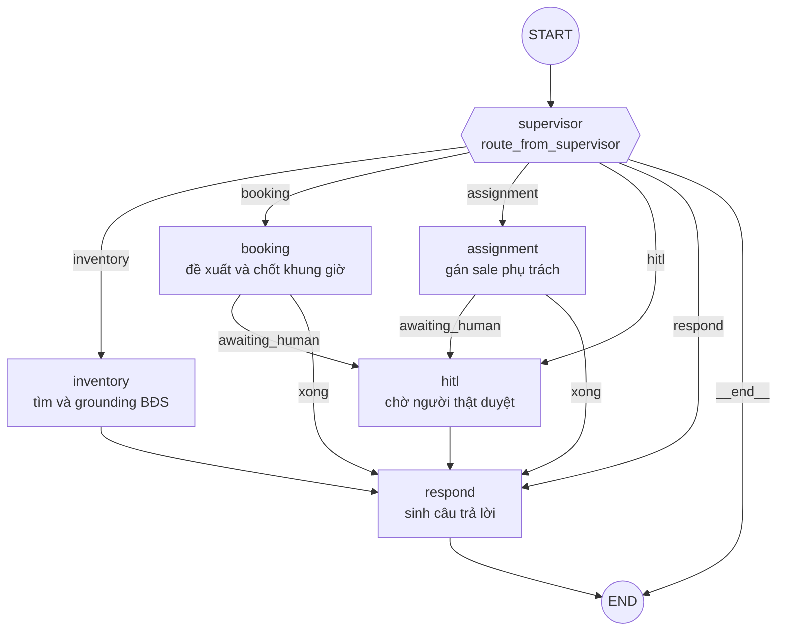

# Architecture Diagram — Nera

Sơ đồ hệ thống đầy đủ (frontend, backend, dữ liệu, triển khai) nằm ở
[`ARCHITECTURE.md`](../ARCHITECTURE.md). File này vẽ riêng đồ thị tác tử, vì đó
là phần dễ lệch với mã nguồn nhất.

## Đồ thị LangGraph

Dựng đúng theo `build_agent_graph()` trong
[`src/agents/graph.py`](../src/agents/graph.py). Sáu node, entry point là
`supervisor`, mọi nhánh đều kết thúc ở `respond`.

Điều kiện rẽ sang `hitl` là `state["awaiting_human"]` — do `_route_after_worker`
quyết định, không phải LLM. Đây là chốt chặn để một lịch hẹn chỉ chuyển sang
`CONFIRMED` sau khi nhân viên sale bấm duyệt.

Mỗi node được bọc bởi `_timed()`, ghi thời gian từng chặng vào
`state["stage_timings"]`; đây là nguồn số cho các báo cáo độ trễ trong
[`eval/results/`](../eval/results/).

## Tech stack

| Thành phần | Công nghệ | Vai trò |
|---|---|---|
| Frontend | Next.js App Router, deploy Vercel | Chat, dashboard sale/admin, quản lý lịch hẹn |
| Backend | FastAPI, deploy Render | REST + SSE, RBAC, nghiệp vụ booking |
| Multi-agent | LangGraph StateGraph | Sáu node ở trên |
| LLM | OpenRouter (định tuyến động theo model) | Trích xuất intent bằng Structured Outputs, sinh câu trả lời |
| Dữ liệu | PostgreSQL 18 bảng, 3.796 BĐS thật | Nguồn duy nhất cho kết quả tìm kiếm |
| Cache/state | Redis, có fallback bộ nhớ tiến trình | Trạng thái hội thoại, giữ chỗ |
| Bản đồ | Goong Maps Geocode + DistanceMatrix | Khoảng cách và thời gian đi xe máy |
| Observability | Langfuse | Trace từng lượt, gom theo phiên |

Không có vector store trong hệ thống. Tìm kiếm chạy bằng SQL trên bảng
`properties` sau khi bộ trích xuất regex và LLM chốt ràng buộc cứng — chọn cách
này để câu trả lời luôn truy ngược được về một bản ghi có thật.
