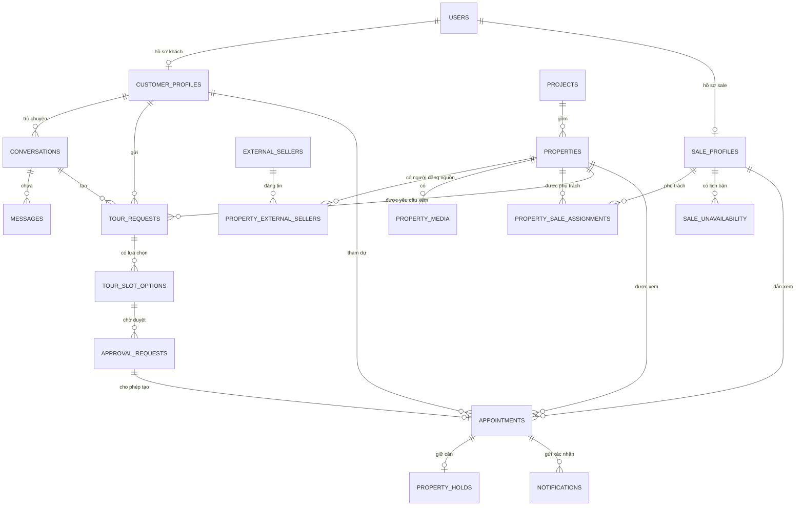
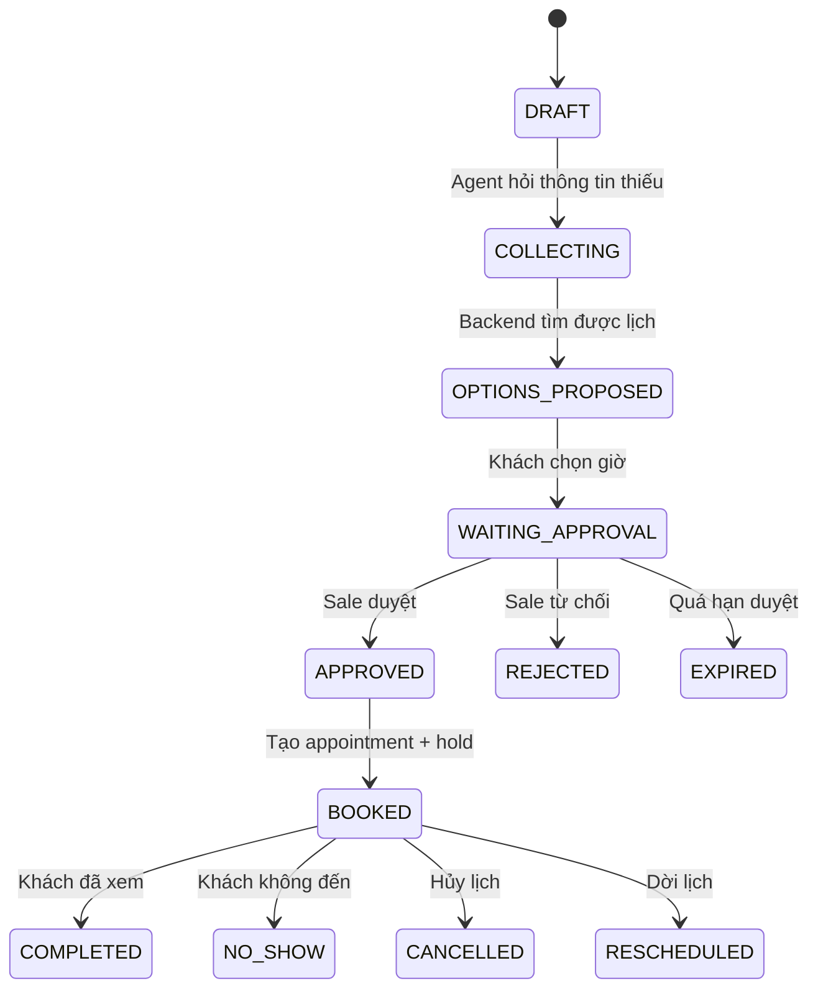

# Thiết kế database XHome VisitOps

## Phạm vi

Schema canonical gồm đúng **18 bảng MVP**, đủ để đăng nhập, quản lý seller nguồn,
tìm căn, chat với agent, đề xuất giờ, HITL sale duyệt, chốt lịch, giữ căn và gửi
xác nhận. Quản lý đội xe và các module nâng cao không nằm trong schema khởi tạo;
khi cần sẽ được bổ sung bằng migration riêng.

## ERD chính



## 18 bảng MVP

1. `users`
2. `customer_profiles`
3. `sale_profiles`
4. `projects`
5. `properties`
6. `external_sellers`
7. `property_external_sellers`
8. `property_media`
9. `property_sale_assignments`
10. `sale_unavailability`
11. `conversations`
12. `messages`
13. `tour_requests`
14. `tour_slot_options`
15. `approval_requests`
16. `appointments`
17. `property_holds`
18. `notifications`

## User, sale nội bộ và seller nguồn

- `users` là tài khoản có quyền đăng nhập: customer, sale, coordinator hoặc admin.
- `sale_profiles` là nhân viên nội bộ xác nhận và dẫn khách đi xem nhà.
- `external_sellers` là chủ tài khoản đăng tin công khai trên Nhà Tốt/Batdongsan.
- `property_external_sellers` liên kết người đăng nguồn với từng bất động sản.
- Seller crawler về không được tự động biến thành `users` và chỉ giữ số điện thoại đã che.

Mỗi căn có tối đa một seller nguồn chính và một sale nội bộ chính đang hoạt động. Hai
quan hệ này độc lập: seller cung cấp nguồn tin, còn sale chịu trách nhiệm quy trình O2O.

## Luồng booking



## Chống double-booking

`appointments` có hai exclusion constraint PostgreSQL:

```sql
EXCLUDE USING GIST (sale_user_id WITH =, appointment_during WITH &&)
EXCLUDE USING GIST (property_id WITH =, appointment_during WITH &&)
```

Hai appointment đang `CONFIRMED` hoặc `IN_PROGRESS` không thể dùng cùng sale
hoặc cùng căn trong các khoảng thời gian chồng nhau.

## HITL được bảo vệ ở database

Trigger `trg_validate_approved_appointment` kiểm tra:

- Approval phải có trạng thái `APPROVED`.
- Sale phải đúng sale đã được duyệt.
- Giờ bắt đầu và kết thúc phải đúng quyết định của sale.

Như vậy frontend hoặc agent không thể bỏ qua bước HITL bằng cách gọi thẳng API tạo lịch.

## Transaction chốt lịch

Backend nên làm trong một transaction:

```sql
BEGIN;

SELECT expire_stale_booking_records();

SELECT id
FROM properties
WHERE id = :property_id
FOR UPDATE;

UPDATE approval_requests
SET status = 'APPROVED',
    decided_by_user_id = :sale_id,
    decided_at = now(),
    approved_sale_user_id = :sale_id,
    approved_starts_at = :starts_at,
    approved_ends_at = :ends_at,
    version = version + 1
WHERE id = :approval_id
  AND status = 'PENDING'
  AND expires_at > now()
  AND version = :expected_version;

-- Backend yêu cầu UPDATE trả về đúng một dòng.
-- Sau đó INSERT appointments, property_holds và notifications.
-- Nếu trùng lịch, exclusion constraint làm transaction thất bại.

COMMIT;
```

## Soft-hold

- Mỗi appointment có tối đa một hold.
- Mỗi property có tối đa một hold `ACTIVE`.
- `expires_at` là thời gian hết hạn hiện tại.
- `max_expires_at` giới hạn gia hạn.
- Worker gọi hàm sau mỗi phút:

```sql
SELECT expire_stale_booking_records();
```

## Lưu ý triển khai

- Lưu timestamp bằng `TIMESTAMPTZ`, hiển thị theo `Asia/Ho_Chi_Minh`.
- Mật khẩu dùng Argon2id.
- Điện thoại chuẩn hóa E.164 trước khi insert.
- Không lưu OAuth token thô trong database.
- Dùng Alembic cho mọi thay đổi sau lần khởi tạo đầu tiên.
