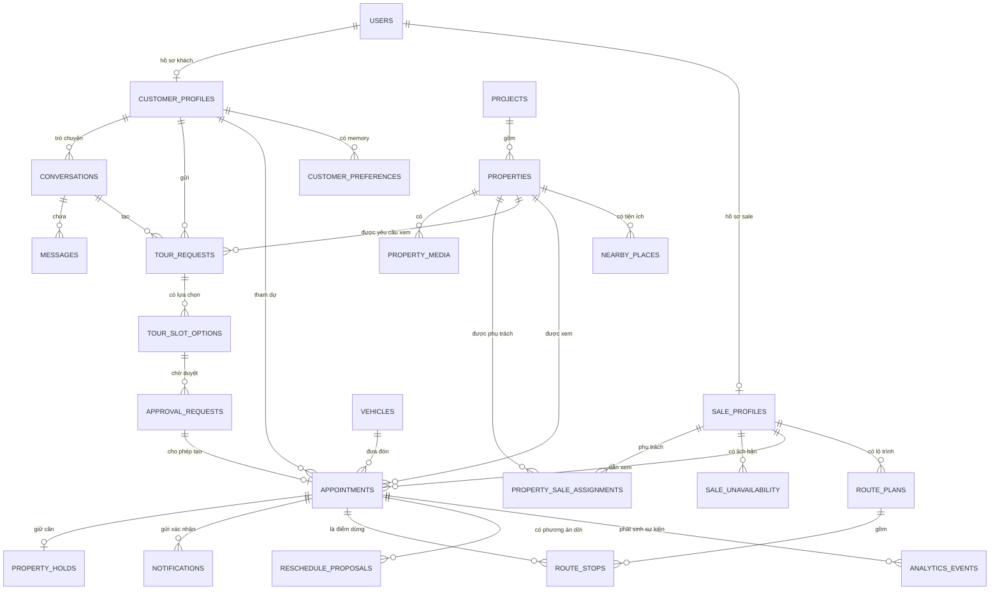
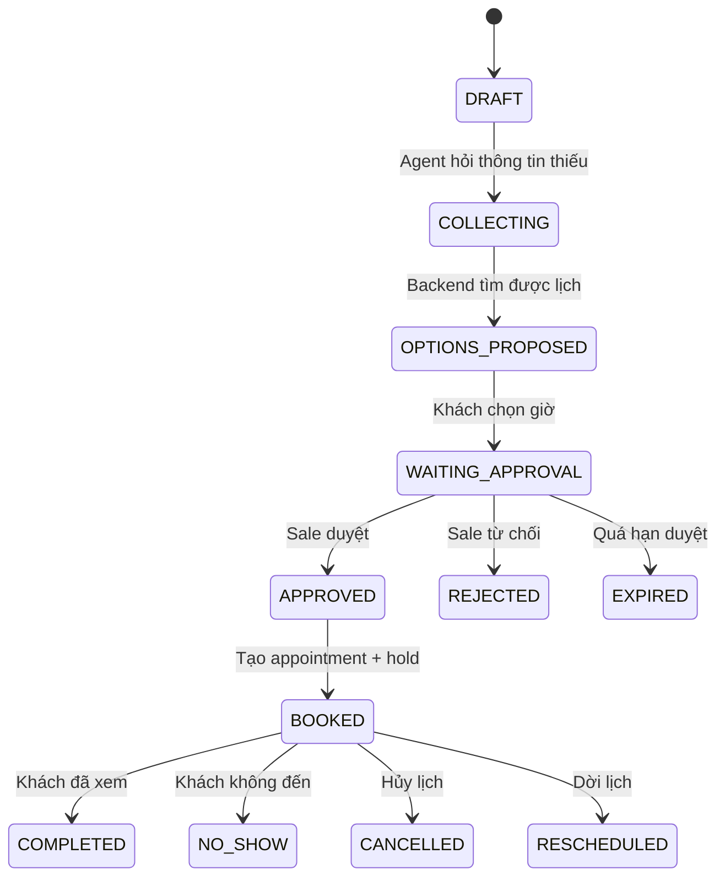

# Thiết kế database XHome VisitOps

## Phạm vi

Schema gồm 24 bảng, chia thành:

- **17 bảng cơ bản:** đủ để đăng nhập, tìm căn, chat với agent, đề xuất giờ,
  HITL sale duyệt, chốt lịch, giữ căn và gửi xác nhận.
- **7 bảng nâng cao:** memory, route optimization, dời lịch, bản đồ, eval và audit.

Các bảng nâng cao được thiết kế độc lập. Chúng có thể để trống khi nhóm mới làm MVP.

## ERD chính



## Luồng booking



## Chống double-booking

`appointments` có ba exclusion constraint PostgreSQL:

```sql
EXCLUDE USING GIST (sale_user_id WITH =, appointment_during WITH &&)
EXCLUDE USING GIST (property_id WITH =, appointment_during WITH &&)
EXCLUDE USING GIST (vehicle_id WITH =, appointment_during WITH &&)
```

Hai appointment đang `CONFIRMED` hoặc `IN_PROGRESS` không thể dùng cùng sale,
cùng căn hoặc cùng xe trong các khoảng thời gian chồng nhau.

## HITL được bảo vệ ở database

Trigger `trg_validate_approved_appointment` kiểm tra:

- Approval phải có trạng thái `APPROVED`.
- Sale phải đúng sale đã được duyệt.
- Xe phải đúng xe đã được duyệt.
- Giờ bắt đầu và kết thúc phải đúng quyết định của sale.

Như vậy frontend hoặc agent không thể bỏ qua bước HITL bằng cách gọi thẳng API tạo lịch.

## Transaction chốt lịch

Backend nên làm trong một transaction:

```sql
BEGIN;

SELECT expire_stale_booking_records();

SELECT id
FROM properties
WHERE id = :property_id
FOR UPDATE;

UPDATE approval_requests
SET status = 'APPROVED',
    decided_by_user_id = :sale_id,
    decided_at = now(),
    approved_sale_user_id = :sale_id,
    approved_vehicle_id = :vehicle_id,
    approved_starts_at = :starts_at,
    approved_ends_at = :ends_at,
    version = version + 1
WHERE id = :approval_id
  AND status = 'PENDING'
  AND expires_at > now()
  AND version = :expected_version;

-- Backend yêu cầu UPDATE trả về đúng một dòng.
-- Sau đó INSERT appointments, property_holds và notifications.
-- Nếu trùng lịch, exclusion constraint làm transaction thất bại.

COMMIT;
```

## Soft-hold

- Mỗi appointment có tối đa một hold.
- Mỗi property có tối đa một hold `ACTIVE`.
- `expires_at` là thời gian hết hạn hiện tại.
- `max_expires_at` giới hạn gia hạn.
- Worker gọi hàm sau mỗi phút:

```sql
SELECT expire_stale_booking_records();
```

## Eval

Backend ghi các event vào `analytics_events`, ví dụ:

```text
TOUR_REQUEST_SUBMITTED
SLOT_OPTIONS_SHOWN
CUSTOMER_SELECTED_SLOT
SALE_APPROVED
BOOKING_CONFIRMED
BOOKING_FAILED
APPOINTMENT_COMPLETED
APPOINTMENT_NO_SHOW
```

Từ đó tính:

```text
booking_success_rate = BOOKING_CONFIRMED / TOUR_REQUEST_SUBMITTED
no_show_rate = APPOINTMENT_NO_SHOW / BOOKING_CONFIRMED
approval_rate = SALE_APPROVED / WAITING_APPROVAL
```

## Lưu ý triển khai

- Lưu timestamp bằng `TIMESTAMPTZ`, hiển thị theo `Asia/Ho_Chi_Minh`.
- Mật khẩu dùng Argon2id.
- Điện thoại chuẩn hóa E.164 trước khi insert.
- Không lưu OAuth token thô trong database.
- Dùng Alembic cho mọi thay đổi sau lần khởi tạo đầu tiên.
